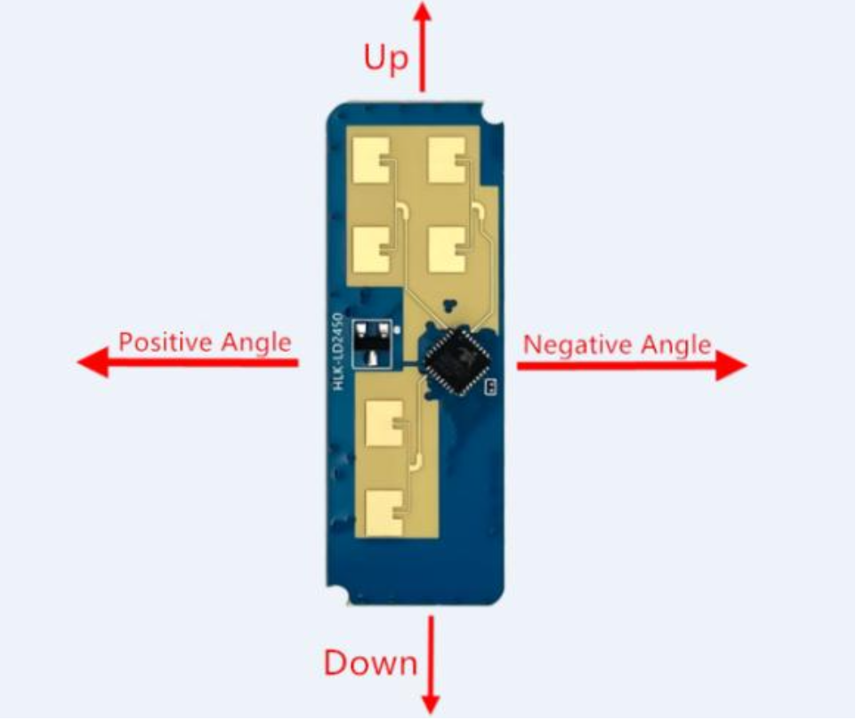

# Art project with HLK-LD2450 Human detection sensor (Microwave-based)

This repo is using a HLK-LD2450 microwave human presence sensor and a [Sparkfun Thing Plus](https://www.sparkfun.com/products/15663). This uses Micropython. See below for instructions to set it up.

When at least one human being is in a pre defined target area in front of the sensor, a relay is triggered. In this application, this relay is wired to eg. a 30VAC source that switches off a PDLC foil (Polymer Dispersed Liquid Crystal) in front of a mirror.

Change the area in which the relay triggers in the `main.py` file:
```
p1 = (-50, 600)
p2 = (50, 600)
p3 = (50, 0)
p4 = (-50, 0)
```
Points clockwise, all values in cm.

Based on
- <https://github.com/christianDUCROS/ld2410-human_sensor>
- <https://github.com/QuirkyCort/IoTy/blob/main/public/extensions/ld2410.py>


# Sensor
Can be installed in case, but must have good wave transmission characteristics at 24 GHz and cannot contain metallic materials or materials that have a shielding effect on electromagnetic waves.

For example data and a lot more, check out the
[> HLK-LD2450-Instruction-Manual.pdf](docs/HLK-LD2450-Instruction-Manual.pdf).

## Sensor mounting direction


## Specs
|Key|Value|
|--|--|
|Max targets|3|
|ISM band|24 GHz|
|Detection distance|6m|
|Detection angle|±60°|
|Data per target|Xmm, Ymm, Speed mm/s|

> **Attention**:
> - Do not install multiple sensor directly opposite to each other to avoid mutual interference
> - Install 150cm to 200cm from floor


# SOFTWARE
## Micropython
### Firmware - once per device
Get <https://github.com/espressif/esptool>
First, erase flash memory from dir `esptool-maser`

```
cd _archive/esptool
esptool.py --port /dev/cu.usbserial-02762195 erase_flash
```

If:
```
A fatal error occurred: Could not open /dev/cu.usbserial-02762195, the port is busy or doesn't exist.
([Errno 16] could not open port /dev/cu.usbserial-02762195: [Errno 16] Resource busy: '/dev/cu.usbserial-02762195')
```
**Unconnect & reconnect**, immedietly run the command above again

Download generic firmware esp wroom:
- <https://micropython.org/download/#esp32>
- <https://micropython.org/download/ESP32_GENERIC/>

Eg. `v1.23.0 (2024-06-02) .bin`

Flash firmware:
```
esptool.py --chip esp32 --port /dev/cu.usbserial-02762195 --baud 460800 write_flash -z 0x1000 ESP32_GENERIC-20240602-v1.23.0.bin 
```


### To upload code
For vscode:
- pymakr extension install
- "new project" from sidebar
- `connect device` or three dots when hovering over project name `select devices`
- Click on the bolt on the device (if greyed out, right click three dots `stop script`)
- To upload click on "upload cloud" when hovering over device name
- After upload, three dots on device, `hard reset device`

> **Attention**
> - When changing the `pymakr.conf` file, its changes only take effect after its uploaded to the board. Right click on the `pymakr.conf` file > "pymakr" > "upload to device" before you upload the whole thing
> - When using "Development mode" (auto-upload files after each change), folders, subfolders and their content (like the `libraries`) do not get uploaded

### When in death loop
Delete main file directly on the flash memory:
- pip install oder so rshell & repl
- `rshell --port /dev/cu.usbserial-0275EAB2`
- `repl ~ /dev/cu.usbserial-0275EAB2`
- `ctrl+x = exit`
- `import os`
- `os.remove("main.py")`

# Pymakr.conf
Example:
```
{
  "py_ignore": [
    "_archive",
    "_tools",
    "docs",
    ".DS_Store",
    ".git",
    ".gitignore",
    ".gitmodules",
    ".vscode",
    "env",
    "README.md",
    "README.pdf",
    "venv"
  ],
  "name": "Rebekkas Smart Foil Extravaganza"
}
```

In terminal:
```
import os
os.listdir()
os.chdir("libraries")
```


### Interesting links from our research
- Library taken from https://github.com/QuirkyCort/IoTy/blob/main/public/extensions/ld2410.py
- Alternatively this french guy is using a similar or the same library:
    - https://www.youtube.com/watch?v=QDC7T2RiKgo
    - https://github.com/christianDUCROS/ld2410-human_sensor
- Arduino edition: https://github.com/0ingchun/arduino-lib_HLK-LD2450_Radar
