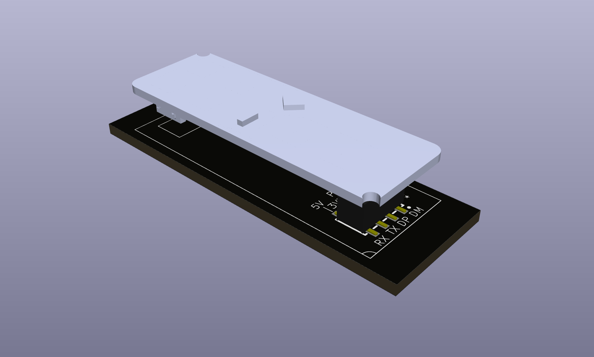

Radar Sensor HiLink LD2450
==========================

Kicad footprint for HiLink LD2450

To add this to your KiCad project issue the following commands:

    git submodule add https://github.com/besi/kicad-ld2450 lib/ld2450
    echo '  (lib (name "ld2450")(type "KiCad")(uri "${KIPRJMOD}/lib/ld2450/ld2450.kicad_sym")(options "")(descr ""))' >> sym-lib-table
    echo '  (lib (name "ld2450")(type "KiCad")(uri "${KIPRJMOD}/lib/ld2450/ld2450.pretty")(options "")(descr ""))' >> fp-lib-table

## Credits

3D Model by [Pascal Laurey](https://grabcad.com/library/radar-sensor-module-hlk-ld2450-human-presence-motion-1)

